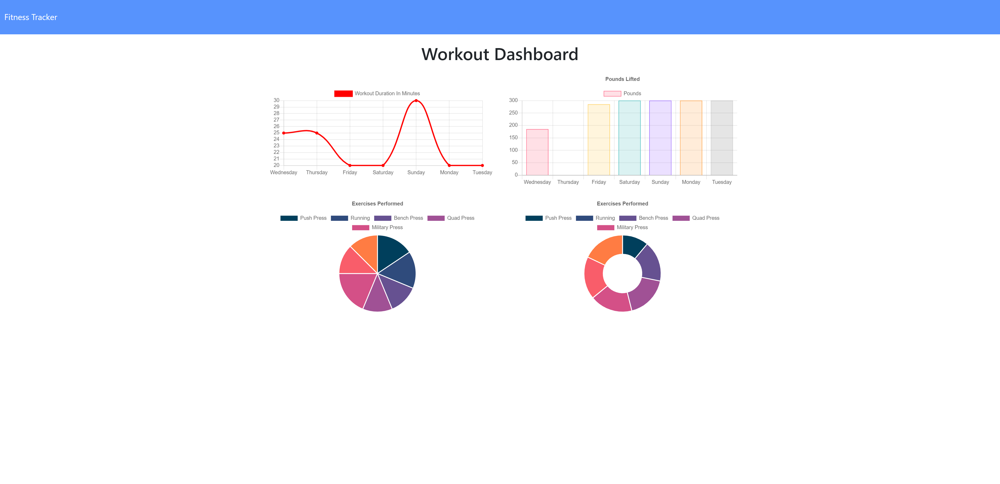

# Workout-Tracker

View create and track daily workouts, log multiple exercises in a workout on a given day. Cardio can be tracked by distance traveled.

## Description

- As a user, I want to be able to view create and track daily workouts. I want to be able to log multiple exercises in a workout on a given day. I should also be able to track the name, type, weight, sets, reps, and duration of exercise. If the exercise is a cardio exercise, I should be able to track my distance traveled.

## Table of Contents

- [Installation](#installation)
- [Usage](#usage)
- [License](#license)
- [Contributing](#contributing)
- [Questions](#questions)
- [Links](#links)

## Installation

Clone the repo and run `npm install` for the required dependencies

## Usage

- Application will be invoked by using the `node server.js` command in the terminal.
- To seed the database run `node seeders/seed.js` in the terminal

## License

This program is free software: you can redistribute it and/or modify
it under the terms of the GNU General Public License as published by
the Free Software Foundation, either version 3 of the License, or
(at your option) any later version.
This program is distributed in the hope that it will be useful,
but WITHOUT ANY WARRANTY; without even the implied warranty of
MERCHANTABILITY or FITNESS FOR A PARTICULAR PURPOSE.See the
GNU General Public License for more details.
You should have received a copy of the GNU General Public License
along with this program. If not, see <https://www.gnu.org/licenses/>

## Contributing

Open source, feel free to modify and change!

## Questions

Check out my other repositories in the link below:

- [GitHub Profile](https://github.com/jongomezdev)

- For any additional questions, please [email](mailto:jongomezdev@gmail.com) me.

## Links

- [Deployed App](https://jg-workout-tracker.herokuapp.com/)
- [Repo](https://github.com/jongomezdev/Workout-Tracker)

## Demo

The following media demonstrates the application functionality:

